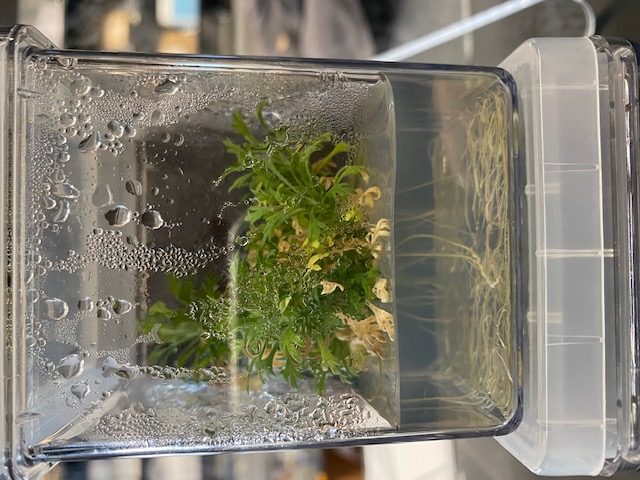
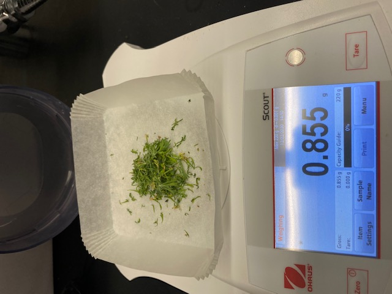

--- 
title: 'Biomass production'
output:
  bookdown::html_document2: 
    toc: TRUE
    toc_depth: 4
    toc_float: TRUE
link-citations: yes
fontsize: 12pt
bibliography: References.bib
csl: AmJBot.csl
---

```{r packages, echo=FALSE, warning=FALSE, include=FALSE}
library(knitr)
library(rmarkdown)
library(bookdown)
#library(distill)
library(knitcitations)
library(formatR)
library(devtools)
library(usethis)
library(lubridate)
library(scales)

#Generate BibTex citation file for all R packages used to produce report
knitr::write_bib(.packages(), file = 'packages.bib')
```


```{r setup, include=FALSE, cache=FALSE, message = FALSE}
#Load packages
library(knitr)
library(rmarkdown)
# Chunk options: see http://yihui.name/knitr/options/ ###

## Text results
opts_chunk$set(echo = TRUE, warning = TRUE, message = TRUE, include = TRUE)

## Code decoration
#opts_chunk$set(tidy = TRUE, R.options = list(width = 60), highlight = TRUE)

## Caching code
opts_chunk$set(cache = 2, cache.path = "cache/")

## Plots
#opts_chunk$set(fig.path = "Figures_MS/", dev=c('pdf', 'png'), dpi = 300)

## Locate figures as close as possible to requested position (=code)
#opts_chunk$set(fig.pos = "H")
```

# Biomass requirements for genome project

We aim at applying the newly developed *in vitro* tissue culture technique [@Barron2020] to the `G2_b24_1` individual line (from UTT2, drought-sensitive genotype; see Figure \@ref(fig:plantlets)) to produce the ca. 120 gr of leaf biomass necessary for genome sequencing, phasing and annotation. As mentioned in our introduction, we also need to make sure that we are maintaining the individual line beyond biomass production to support genome to phenome research (based on GxE experiments). 

```{r plantlets, echo=F, eval=T, out.width="40%", fig.align='center', fig.cap= "Example of a 15-week old plantlet grown in vitro in Magenta vessel."}

```

## Adapting approach to biomass production

Our propagation method (see [here](Individual_lines.html) for more details) to maintain individual line *in vitro* works very well, but after 8-10 weeks of growth a plantlet only generates ca. 0.15 gr of biomass for genome sequencing. This is only when allocating 1 plantlet per Magenta vessel. Indeed, sagebrush are competing using chemical compounds and putting several individuals per Magenta vessel decreases growth and increases mortality. Overall, if we were to apply to approach to generate the necessary 120 gr for the sagebrush genome project, we would need **`r 120/0.15` plantlets**. This large number of plantlet is logistically challenging and could prove difficult to handle for our small to middle size lab. This is even more challenging because although our methodology has a high (>90%) rooting response, the survival rate during the <span style="color: black;font-weight:bold">growth</span> step is highly variable between individual lines. For instance, the top performer as identified by @Barron2020, `G2_b27_1`, has only a 45% survival rate in the second round of propagation, whereas `G2_b24_1` has a 80% survival rate at the same stage. This evidence means that far more plantlets would have to be cultivated to reach the **`r 120/0.15` plantlets** mark (corresponding to 120 gr.). This latter estimate is without accounting for a cushion to maintain the individual line for genome to phenome research. In this context, we have favored i) selecting an individual with a high survival rate and ii) growing plantlets for a longer period to obtain more biomass. To differentiate this stage of the propagation to our regular steps, we will be referring to the allocation of plantlets to biomass production as <span style="color: orange;font-weight:bold">biobanking</span> (see below for more details).    

### Using 15-week old `G2_b24_1` plantlets to produce biomass

After 15 weeks of *in vitro* tissue culture, **a plantlet produces ca. 0.8 gr. of leaf biomass** that can be used for sequencing (Figure \@ref(fig:plantletweight)). Thus, **a minimum of `r 120/0.8` plantlets have to be produced** to sequence the genome (see Table \@ref(tab:tabproject)). This number is much more manageable and means that all the plantlets can be grown in individual Magenta vessels under optimum growth conditions in our Percival culture chamber. When ready, the biomass will be flash frozen (using liquid nitrogen) and stored at -80C before being shipped to the sequencing facility. However, the estimation of biomass provided here does not account for a DNA extraction trial required to optimize protocol (we need at least 15<span>&#181;</span>g of HMW DNA for PacBio sequencing). We will have to discuss this with the project manager at Dovetail Genomics.

```{r plantletweight, echo=F, eval=T, out.width="50%", fig.align='center', fig.cap= "A 15-week old plantlet grown in vitro in Magenta vessel generates 0.8 gr of leaf biomass for sequencing."}

```

# Planning biomass production for sequencing

To be able to plan the biomass production for genome sequencing, while also maintaining the individual line, we have developed an R function called *propagationPred*. This function incorporates 4 steps (<span style="color: black;font-weight:bold">Growth</span>, <span style="color: green;font-weight:bold">Cutting</span>, <span style="color: blue;font-weight:bold">Rooting</span> and <span style="color: orange;font-weight:bold">Biobanking</span>) as well as the rooting and survival rates. In addition, the use can define duration for the <span style="color: black;font-weight:bold">Growth</span>, <span style="color: blue;font-weight:bold">Rooting</span> and <span style="color: orange;font-weight:bold">Biobanking</span> steps, which allows establishing a schedule. Finally, this function also incorporates details on times necessary for preparing media and number of plates and Magenta vessels required to complete propagation protocols. The function is presented below. 

## Presenting R *propagationPred* function

*propagationPred* depends on the following set of arguments provided by the user:

- `n`: number of plantlets to seed the experiment.
- `ns`: number of shoot tips cut per plantlet (after the growth period).
- `r`: vector of rooting rates (0 to 1) at each rooting phase. 
- `s`: vector of survival rates (0 to 1) at each growth phase.
- `g`: number of generations (for *in vitro* propagation).
- `biobank`: vector with proportion (0 to 1) of plantlets biobanked per generation (at end of growth) (e.g: c(0,0,0.4,0)). This argument is important since it is equal to the number of plantlets set aside for biomass production.
- `date_user`: starting date of the experiment (mdy from *ludridate* or any date format).
- `growth_time_g`: vector with number of days/weeks allocated for growth per `g` (how long will it take for your plantlets to produce `ns`).
- `biobanking_time`: one value (either weeks() or days()) compatible with *lubridate* describing the duration of biobanking to generated the biomass (here 15 weeks corresponding to 0.8 gr).
- `rooting_time_g`: vector with number of days/weeks for rooting per `g`. The rooting time is a key factor, you want to allocate enough time for roots to develop and growth.
- `biomass_plantlet`: numerical value of biomass of a single plantlet (here 0.8 gr).

The function outputs a `data.frame` with the following columns:

- `Generation`: Generation ID.
- `Type`: Type of *in vitro* activity (`Growth`, `Cutting`, `Rooting`, `Biobanking`).
- `Date_start` and `Date_end`: Start and end date associated to `Type`.
- `N_plant_start` and `N_plant_end`: Number of plantelts at stat and end dates.
- `N_vessels`: Number of plates (for `Rooting`) or Magenta (for `Growth`) vessels. 1 plate = 9 shoot tips, whereas rooted shoot tips are on individual Magenta vessels.            
- `Volume_media_litre`: Amount of `Rooting` (0.05 liter per plate) or `Growth` (0.1 liter per Magenta vessel) media to be prepared.    
- `N_Autoclave` and `Time_Autoclave (hrs)`: Number of autoclaves used to prepare `Rooting` (1 liter per autoclave) or `Growth` (60 Magenta vessels per autoclave) media and associated times (120 minutes for `Rooting` media vs. 90 minutes for `Growth` media). 
- `Media_prep_time (hrs)` and `Time_Cutting (hrs)`: Lab our time to prepare `Rooting` (90 minutes for 1 liter) or `Growth` (1 hr for 60 boxes) media and conduct cutting (5 plantlets per hour).   
- `Total_Biomass (gr)`: This is estimated based on fraction of plantlets allocated to biobanking (based on `biomass_plantlet`).    

The output can directly be used to plan *in vitro* propagation, but can also be easily used as input to produce a plot showing the different steps through time (see below).

# Scheduling propagation of `G2_b24_1`

As mentioned above, we have selected the `G2_b24_1` individual line as candidate for the Sagebrush Genome Project. In this section, we are using *propagationPred* to:

- Provide timetable of biomass production, especially to identify when the biomass will be ready to be delivered to Dovetail Genomics for sequencing.
- Logistically organize the biomass production.


## Settings applied for analyses

The *propagationPred* function has been applied with the following parameters (see section \@ref(predcode) for R code):

- `n`: 6 plantlets at generation 1.
- `ns`: 9.5 (on average) shoot tips per plantlets after 10 weeks of growth.
- `r`: 0.93 rooting rate (same at each generation). 
- `s`: 0.8 survival rate (same at each generation).
- `g`: 4 generations of propagation.
- `biobank`: c(0,0,0.9,0). Meaning that 90% of plantlets will be biobanked at generation 3. Based on preliminary analyses, this should provide sufficient number of plantlets for biomass production. 
- `date_user`: `r mdy("11/13/2020")-weeks(10)` is the beginning of growth period at generation 1.
- `growth_time_g`: c(weeks(10),weeks(8),weeks(8),weeks(8)).
- `biobanking_time`: weeks(15). This corresponds to the duration required for a plantlet to produce 0.8 gr of leaf biomass.
- `rooting_time_g`: c(weeks(4),weeks(3),weeks(3),weeks(3)).
- `biomass_plantlet`: 0.8 (in gr).

## Timetable of biomass production

A detailed timetable for each steps of the propagation procedure of the `G2_b24_1` individual line is available below. 

```{r predictionprop, echo=FALSE, eval=TRUE}
#Source user-made function
source("Functions/Propagation.R")

#Apply propagationPred to top performer (G2_b24_1 from UTT2)
OUTdat <- propagationPred(n=6, ns=9.5, r=rep(0.93,4), s=rep(0.8,4), g=4, biobank=c(0,0,0.9,0), date_user=mdy("11/13/2020")-weeks(10), growth_time_g=c(weeks(10),weeks(8),weeks(8),weeks(8)), biobanking_time = weeks(15), rooting_time_g=c(weeks(4),weeks(3),weeks(3),weeks(3)), biomass_plantlet = 0.8)

#Subset OUTdat to only contain rows of interests
OUTdat <- OUTdat[1:11,]

#Plot table
DT::datatable(OUTdat[,1:6], extensions = 'Buttons', options = list(dom = 'Blfrtip', buttons = c('copy', 'csv', 'excel', 'pdf', 'print')))
```

### Key highlights

- On `r OUTdat[8,3]`, `r OUTdat[8,5]` rooted plantlets transferred into individual Magenta vessels will be <span style="color: orange;font-weight:bold">biobanked</span> in a dedicated Percival. Based on our prediction, **`r OUTdat[8,6]` plantlets will survived and produce `r OUTdat[8,13]` gr. of biomass by `r OUTdat[8,4]`**. 
- The biomass production should largely exceed the needs of the project, which might suggest that we could deliver the biomass sooner. However, this remains a prediction, which will have to be confirmed.  
- To better visualize the timetable, a plot was produced and it highlights the key dates and facts (see Figure \@ref(fig:plotpred)).

```{r plotpred, echo=FALSE, eval=TRUE, fig.width=10, fig.height=10, fig.align='center', fig.cap= "Plot showing the time frame to conduct the in vitro propagation of G2_b24_1 to produce the biomass for the Sagebrush Genome Project and maintain the individual line."}
###~~~
#Plot data
###~~~
#pdf("Schedule_sagebrush_propagation_G2_b24_1.pdf")
#Populate plot
Type <- levels(OUTdat$Type)[c(3,2,4,1)]
colSeg <- c("black","green","blue","orange")

#Create empty plot
plot(x=c(as.Date(OUTdat$Date_start)), y= c(as.numeric(as.vector(OUTdat$N_plant_start))), 
     xlim= c(min(as.Date(OUTdat$Date_start)), max(as.Date(OUTdat$Date_end))+20), 
     ylim=c(0, max(as.numeric(as.vector(OUTdat$N_plant_start)))+50), type='n', xlab="Time (days)", ylab = "Number of Plantlets") 

biomassTot <- 120
biomass_plantlet <- 0.8
#Add objective of N plantlets
abline(h=biomassTot/biomass_plantlet, col='grey')
text(x=as.Date(OUTdat$Date_start[1]), y=biomassTot/biomass_plantlet+10, labels=paste("Number of Plantlets for Project (N: ", biomassTot/biomass_plantlet, " = ", biomassTot, " gr. )", sep=""), adj=0, col="grey", cex=.65)

#Add segments
for(i in 1:length(Type)){
  tmp <- OUTdat[which(OUTdat$Type == Type[i]),]
  segments(x0=as.Date(tmp$Date_start), x1=as.Date(tmp$Date_end), y0=as.numeric(as.vector(tmp$N_plant_start)), y1=as.numeric(as.vector(tmp$N_plant_end)), col=colSeg[i], lwd=1.5)
  #Add points to better see beginning and end of phases
  points(x=as.Date(tmp$Date_start), y=as.numeric(as.vector(tmp$N_plant_start)), col=colSeg[i], pch=16, cex=.8)
  points(x=as.Date(tmp$Date_end), y=as.numeric(as.vector(tmp$N_plant_end)), col=colSeg[i], pch=16, cex=.8)
  
  if(Type[i] == "Cutting"){
    text(x=as.Date(tmp$Date_start), y=as.numeric(as.vector(tmp$N_plant_end))+20, labels = as.Date(tmp$Date_start), srt=45, adj=0.5, cex=.6)
  }
  if(Type[i] == "Rooting"){
    text(x=as.Date(tmp$Date_end), y=as.numeric(as.vector(tmp$N_plant_end))+8, labels = as.Date(tmp$Date_end), srt=45, adj=0, cex=.6)
  }
  if(Type[i] == "Growth"){
    #Start of experiment
    startExp <- which(tmp$Date_start == as.character(min(as.Date(tmp$Date_start))))
    text(x=as.Date(tmp$Date_start)[startExp], y=as.numeric(as.vector(tmp$N_plant_start))[startExp]+8, labels = as.Date(tmp$Date_start)[startExp], srt=90, adj=0, cex=.6)
    
    #End of experiment
    endExp <- which(tmp$Date_end == as.character(max(as.Date(tmp$Date_end))))
    text(x=as.Date(tmp$Date_end)[endExp], y=as.numeric(as.vector(tmp$N_plant_end))[endExp]+8, labels = as.Date(tmp$Date_end)[endExp], srt=90, adj=0, cex=.6)
  }
  if(Type[i] == "Biobanking"){
    #Add segment(s) showing when rooted shoot tips are split between growth and biobanking
    ystart <- as.numeric(as.vector(OUTdat$N_plant_start[which(OUTdat$Date_start == tmp$Date_start & OUTdat$Type == "Growth")]))
    yend <- as.numeric(as.vector(OUTdat$N_plant_end[which(OUTdat$Date_end == as.character(tmp$Date_start) & OUTdat$Type == "Rooting")]))
    segments(x0=as.Date(tmp$Date_start), x1=as.Date(tmp$Date_start), y0=ystart, y1=yend, lty=2) 
    text(x=as.Date(tmp$Date_start)-4, y=ystart, paste("Split rooted shoot tips:", paste(as.character(tmp$Type), " (", tmp$N_plant_start, ")", " & Growth (", ystart, ")", sep="")), adj=0, srt=90, cex=.6)
    
    #End of experiment
    endExp <- which(tmp$Date_end == as.character(max(as.Date(tmp$Date_end))))
    text(x=as.Date(tmp$Date_end)[endExp], y=as.numeric(as.vector(tmp$N_plant_end))[endExp]+8, labels = paste(as.Date(tmp$Date_end)[endExp], " (", as.character(tmp$`Total_Biomass (gr)`), " gr.)", sep=''), srt=90, adj=0, cex=.6)
  }
  
}

#Add legend
legend("topleft", legend = Type, lty=1, col=colSeg, cex=.6)
#dev.off()
```

## Logistical organization

To prepare with each step of the propagation, we are providing key knowledge in the table below:

```{r predictionprop2, eval=T, echo=F}
#Plot table
DT::datatable(OUTdat[,c(1:4,7:12)], extensions = 'Buttons', options = list(dom = 'Blfrtip', buttons = c('copy', 'csv', 'excel', 'pdf', 'print')))
```

### Key highlights

- The <span style="color: green;font-weight:bold">Cutting</span> on `r OUTdat[5,3]` will require `r OUTdat[5,10]` hours of labor. We will have to make sure to coordinate and take 2-3 days to complete this step.
- A total of `r OUTdat[6,5]` Magenta vessels will be needed by `r OUTdat[6,3]`.

## R code {#predcode}

```{r predictionpropcode, echo=TRUE, eval=FALSE}
#Source user-made function
source("Functions/Propagation.R")

#Apply propagationPred to top performer (G2_b24_1 from UTT2)
OUTdat <- propagationPred(n=6, ns=9.5, r=rep(0.93,4), s=rep(0.8,4), g=4, biobank=c(0,0,0.9,0), date_user=mdy("11/13/2020")-weeks(10), growth_time_g=c(weeks(10),weeks(8),weeks(8),weeks(8)), biobanking_time = weeks(15), rooting_time_g=c(weeks(4),weeks(3),weeks(3),weeks(3)), biomass_plantlet = 0.8)

#Subset OUTdat to only contain rows of interests
OUTdat <- OUTdat[1:11,]

#Plot table
DT::datatable(OUTdat, extensions = 'Buttons', options = list(dom = 'Blfrtip', buttons = c('copy', 'csv', 'excel', 'pdf', 'print')))

###~~~
#Plot data
###~~~
#pdf("Schedule_sagebrush_propagation_G2_b24_1.pdf")
#Populate plot
Type <- levels(OUTdat$Type)[c(3,2,4,1)]
colSeg <- c("black","green","blue","orange")

#Create empty plot
plot(x=c(as.Date(OUTdat$Date_start)), y= c(as.numeric(as.vector(OUTdat$N_plant_start))), 
     xlim= c(min(as.Date(OUTdat$Date_start)), max(as.Date(OUTdat$Date_end))+20), 
     ylim=c(0, max(as.numeric(as.vector(OUTdat$N_plant_start)))+50), type='n', xlab="Time (days)", ylab = "Number of Plantlets") 

biomassTot <- 120
biomass_plantlet <- 0.8
#Add objective of N plantlets
abline(h=biomassTot/biomass_plantlet, col='grey')
text(x=as.Date(OUTdat$Date_start[1]), y=biomassTot/biomass_plantlet+10, labels=paste("Number of Plantlets for Project (N: ", biomassTot/biomass_plantlet, " = ", biomassTot, " gr. )", sep=""), adj=0, col="grey", cex=.65)

#Add segments
for(i in 1:length(Type)){
  tmp <- OUTdat[which(OUTdat$Type == Type[i]),]
  segments(x0=as.Date(tmp$Date_start), x1=as.Date(tmp$Date_end), y0=as.numeric(as.vector(tmp$N_plant_start)), y1=as.numeric(as.vector(tmp$N_plant_end)), col=colSeg[i], lwd=1.5)
  #Add points to better see beginning and end of phases
  points(x=as.Date(tmp$Date_start), y=as.numeric(as.vector(tmp$N_plant_start)), col=colSeg[i], pch=16, cex=.8)
  points(x=as.Date(tmp$Date_end), y=as.numeric(as.vector(tmp$N_plant_end)), col=colSeg[i], pch=16, cex=.8)
  
  if(Type[i] == "Cutting"){
    text(x=as.Date(tmp$Date_start), y=as.numeric(as.vector(tmp$N_plant_end))+20, labels = as.Date(tmp$Date_start), srt=45, adj=0.5, cex=.6)
  }
  if(Type[i] == "Rooting"){
    text(x=as.Date(tmp$Date_end), y=as.numeric(as.vector(tmp$N_plant_end))+8, labels = as.Date(tmp$Date_end), srt=45, adj=0, cex=.6)
  }
  if(Type[i] == "Growth"){
    #Start of experiment
    startExp <- which(tmp$Date_start == as.character(min(as.Date(tmp$Date_start))))
    text(x=as.Date(tmp$Date_start)[startExp], y=as.numeric(as.vector(tmp$N_plant_start))[startExp]+8, labels = as.Date(tmp$Date_start)[startExp], srt=90, adj=0, cex=.6)
    
    #End of experiment
    endExp <- which(tmp$Date_end == as.character(max(as.Date(tmp$Date_end))))
    text(x=as.Date(tmp$Date_end)[endExp], y=as.numeric(as.vector(tmp$N_plant_end))[endExp]+8, labels = as.Date(tmp$Date_end)[endExp], srt=90, adj=0, cex=.6)
  }
  if(Type[i] == "Biobanking"){
    #Add segment(s) showing when rooted shoot tips are split between growth and biobanking
    ystart <- as.numeric(as.vector(OUTdat$N_plant_start[which(OUTdat$Date_start == tmp$Date_start & OUTdat$Type == "Growth")]))
    yend <- as.numeric(as.vector(OUTdat$N_plant_end[which(OUTdat$Date_end == as.character(tmp$Date_start) & OUTdat$Type == "Rooting")]))
    segments(x0=as.Date(tmp$Date_start), x1=as.Date(tmp$Date_start), y0=ystart, y1=yend, lty=2) 
    text(x=as.Date(tmp$Date_start)-4, y=ystart, paste("Split rooted shoot tips:", paste(as.character(tmp$Type), " (", tmp$N_plant_start, ")", " & Growth (", ystart, ")", sep="")), adj=0, srt=90, cex=.6)
    
    #End of experiment
    endExp <- which(tmp$Date_end == as.character(max(as.Date(tmp$Date_end))))
    text(x=as.Date(tmp$Date_end)[endExp], y=as.numeric(as.vector(tmp$N_plant_end))[endExp]+8, labels = paste(as.Date(tmp$Date_end)[endExp], " (", as.character(tmp$`Total_Biomass (gr)`), " gr.)", sep=''), srt=90, adj=0, cex=.6)
  }
  
}

#Add legend
legend("topleft", legend = Type, lty=1, col=colSeg, cex=.6)
#dev.off()
```

# References

<div id="refs"></div>

# Appendix 1 {.appendix}

Citations of all R packages used to generate this report. 

```{r generateBibliography, eval = T, results="asis", cache = F, echo=F, warning = FALSE, message=FALSE}
library("knitcitations")
cleanbib()
options("citation_format" = "pandoc")
read.bibtex(file = "packages.bib")
``` 

# Appendix 2 {.appendix}

Version information about R, the operating system (OS) and attached or R loaded packages. This appendix was generated using `sessionInfo()`.

```{r eval=T, echo=F, warning = FALSE, message=FALSE}
sessionInfo()
```
