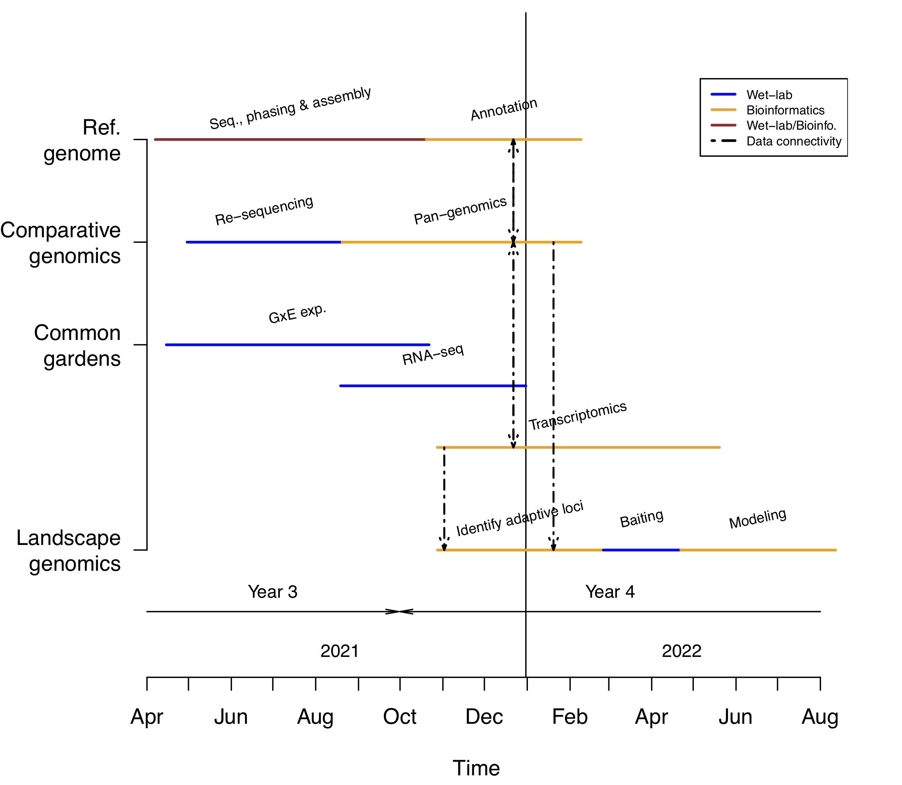

```{js logo-js, echo=FALSE}
$(document).ready(function() {
  $('#header').parent().prepend('<div id=\"logo\"></div>');
  $('#header').css('margin-right', '120px')
});
```

# Aim

Sequencing, phasing and annotating the diploid genome of basin big sagebrush (*Artemisia tridentata* subsp. *tridentata*). This taxon as 2n=2x=18 chromosomes and a 2C genome size of 9.5Gbp [see @Barron2020]. In addition, preliminary analyses demonstrated that the genome is highly out-bred. For these reasons, we are aiming at not only produce enough biomass of the same individual line to produce the genome, but also maintain the individual line both *in vitro* and *ex vitro* to support genotype-by-environment experiments. 

# Overall approach & requirements

To be able to phase such complex genome, we aim at generating 50-100X raw data coverage (haploid sagebrush genome size: 4.5 Gbp) using PacBio technology and phase it using proximity ligation data. Such wet-lab procedures are requiring the production of ca. **120 gr. of leaf biomass**.

Please see the following section of the website for more details on:

- [Propagation of individual lines](Individual_lines.html).
- [Biomass production](Biomass_production.html).
- [Genome sequencing](Sequencing.html).
- [Genome annotation](Annotation.html).
- [Team](Team.html).

# Timetable

The predicted timetable for completion of the sagebrush genome project to support objectives of the GEM3 project is provided in Figure \@ref(fig:timetab). Assembling and annotating the sagebrush genome will serve to assess adaptive capacity of sagebrush populations to cope with drought and heat driven by climate change. This will be done by conducting common garden experiments on [individual lines](Individual_lines.html) of known genomes (serving establishing reference genome and whole genome re-sequencing therefore comparing genomes using a pan-genomics approach) and then at landscape level using adaptive loci (sequenced using a baiting approach) on plants from across the climatic and geographic range of the species.  

```{r timetab, warning = F, echo=F, message = F, results="asis", fig.cap= "Timetable associated to production of data for the sagebrush genome project. Please see text for more details.", out.width = '100%', cache = F}
#Timetable

timetab <- data.frame("Objective" = c(rep("Ref. genome", 2), rep("Comparative genomics",2), rep("Common gardens", 3), rep("Landscape genomics",3)), "Task" = c("Seq., phasing & assembly", "Annotation", "Re-sequencing","Pan-genomics","GxE exp.", "RNA-seq", "Transcriptomics", "Identify adaptive loci", "Baiting", "Modeling"), "Start_Date" = lubridate::mdy(rep("NA", 10)), "End_Date" = lubridate::mdy(rep("NA", 10)))

###
#Ref. genome
# G1_b2
###

#Harvesting biomass?
timetab$Start_Date[1] <- as.Date("04-07-21", tryFormats = c("%m-%d-%y")) 
#Sequencing done
timetab$End_Date[1] <- timetab$Start_Date[1] + lubridate::weeks(28)

#Genome annotation start
timetab$Start_Date[2] <- timetab$End_Date[1]
#Genome annotation end
timetab$End_Date[2] <- timetab$Start_Date[2] + lubridate::weeks(16)

#Comparative genomics (incl. re-sequencing)
#Re-sequencing
timetab$Start_Date[3] <- as.Date("04-30-21", tryFormats = c("%m-%d-%y"))
timetab$End_Date[3] <- timetab$Start_Date[3] + lubridate::weeks(16)
#Pan-genomics
timetab$Start_Date[4] <- timetab$End_Date[3]
timetab$End_Date[4] <- timetab$End_Date[2]

###
#Common gardens
# G1_b2, G2_b27
###

#When ready for GxE
timetab$Start_Date[5] <- as.Date("04-01-21", tryFormats = c("%m-%d-%y")) + lubridate::weeks(2)

#When GxE end?
timetab$End_Date[5] <- as.Date("04-09-21", tryFormats = c("%m-%d-%y")) + lubridate::weeks(28)

#RNA-Seq
timetab$Start_Date[6] <- as.Date("04-01-21", tryFormats = c("%m-%d-%y")) + lubridate::weeks(20)
timetab$End_Date[6] <- timetab$End_Date[5] + lubridate::weeks(10)

#Transcriptomics
timetab$Start_Date[7] <- timetab$Start_Date[6] + lubridate::weeks(10)
timetab$End_Date[7] <- timetab$End_Date[6] + lubridate::weeks(20)

###
#Landscape genomics
# Population sampling
###

#Identify adaptive loci
timetab$Start_Date[8] <- timetab$Start_Date[7]
timetab$End_Date[8] <- timetab$End_Date[6] + lubridate::weeks(8)

#Baiting
timetab$Start_Date[9] <- timetab$End_Date[8]
timetab$End_Date[9] <- timetab$Start_Date[9] + lubridate::weeks(8)

#Modeling
timetab$Start_Date[10] <- timetab$End_Date[9]
timetab$End_Date[10] <- timetab$Start_Date[10] + lubridate::weeks(16)

#Add col with y height
timetab$Y <- c(rep(2.5, 2), 2, 2, 1.5, 1.3, 1, rep(0.5, 3))
#Add color
# Blue = wet-lab
# orange = bioinformatics
# brown = wet/bioinfo
timetab$col <- c("brown", "orange", "blue", "orange", "blue", "blue", "orange", "orange", "blue", "orange")

###
#PLOT
###

pdf(file = "Figures/timetable_whole_project.pdf")
#Plot timetable
plot(x=c(lubridate::floor_date(min(timetab$Start_Date), "month")-10, lubridate::round_date(max(timetab$End_Date), "month")), y= c(0,3), type="n", axes = F, ylab = "", xlab = "")

#Abline to separate years
abline(v =  as.Date("12-31-21", tryFormats = c("%m-%d-%y")))
text(x = as.Date(timetab$Start_Date[1]) + abs(floor((as.Date(timetab$Start_Date[1])-as.Date("12-31-21", tryFormats = c("%m-%d-%y")))/2)), y = 0.01, cex = 0.8, "2021")
text(x = as.Date("01-01-22", tryFormats = c("%m-%d-%y")) + abs(floor(as.Date("01-01-22", tryFormats = c("%m-%d-%y")) - as.Date(max(timetab$End_Date)))/2), y = 0.01, cex = 0.8, "2022")

#Add customed axes
#Y axis = Individual lines
axis(side = 2, at = c(0.5, 1.5, 2, 2.5), las = 2, labels = rev(gsub(" ", "\n", unique(timetab$Objective))), cex= .5, pos=lubridate::floor_date(min(timetab$Start_Date), "month"))

#X axis = time
datespan <- seq(from = lubridate::floor_date(min(timetab$Start_Date), "month"), to = lubridate::round_date(max(timetab$End_Date), "month"), "month")

axis(side = 1, at = datespan, labels = as.vector(lubridate::month(datespan, label = TRUE, abbr = T)))

#Add titles to axes
title(main="", xlab="Time", ylab="")

#Add segments showing tasks
segments(x0 = as.Date(timetab$Start_Date), x1 = as.Date(timetab$End_Date), y0 = as.numeric(timetab$Y), y1 = as.numeric(timetab$Y), lwd = 2, col = timetab$col)

#Print tasks next to arrows
text(x = as.Date(timetab$Start_Date) + floor((as.Date(timetab$End_Date)-as.Date(timetab$Start_Date))/2)  , y = timetab$Y+0.15, as.vector(timetab$Task), srt=12, cex=.7)

#Arrows with fiscal years
#Y3
arrows(x0 = lubridate::floor_date(min(timetab$Start_Date), "month"), x1 = as.Date("09-30-21", tryFormats = c("%m-%d-%y")), y0 = 0.2, y1 = 0.2, length = 0.1, angle = 10)
text(x = lubridate::floor_date(min(timetab$Start_Date), "month") + floor((as.Date("09-30-21", tryFormats = c("%m-%d-%y"))-lubridate::floor_date(min(timetab$Start_Date), "month"))/2), y = 0.3, "Year 3", cex = 0.8)

#Y4
arrows(x0 = as.Date("10-01-21", tryFormats = c("%m-%d-%y")), x1 = lubridate::floor_date(max(timetab$End_Date), "month"), y0 = 0.2, y1 = 0.2, length = 0.1, angle = 10, code = 1)
text(x = as.Date("10-01-21", tryFormats = c("%m-%d-%y")) + abs(floor((as.Date("10-01-21", tryFormats = c("%m-%d-%y"))-lubridate::floor_date(max(timetab$End_Date), "month"))/2)), y = 0.3, "Year 4", cex = 0.8)

#Add connections between tasks
# transcriptomics to annotation
arrows(x0 = timetab$Start_Date[7]+55, x1 = timetab$Start_Date[7]+55, y0 = timetab$Y[7], y1 = timetab$Y[2], score = 1, length = 0.1, lwd = 1.5, lty = 6, angle = 20, col = "black", code = 3)

#Annotation to pan-genomics
arrows(x0 = timetab$Start_Date[7]+55, x1 = timetab$Start_Date[7]+55, y0 = timetab$Y[2], y1 = timetab$Y[4], score = 1, length = 0.1, lwd = 1.5, lty = 6, angle = 20, col = "black", code = 3)

#pan-genomics to transcriptomics
arrows(x0 = timetab$Start_Date[7]+55, x1 = timetab$Start_Date[7]+55, y0 = timetab$Y[7], y1 = timetab$Y[4], score = 1, length = 0.1, lwd = 1.5, lty = 6, angle = 20, col = "black", code = 3)


#Pan-genomics to adaptive loci
arrows(x0 = timetab$End_Date[2]-20, x1 = timetab$End_Date[2]-20, y0 = timetab$Y[4], y1 = timetab$Y[8], score = 1, length = 0.1, lwd = 1.5, lty = 6, angle = 20, col = "black")

#Transcriptomics to adaptive loci
arrows(x0 = timetab$Start_Date[7]+5, x1 = timetab$Start_Date[7]+5, y0 = timetab$Y[7], y1 = timetab$Y[8], score = 1, length = 0.1, lwd = 1.5, lty = 6, angle = 20, col = "black")

# Add a legend
legend("topright", 
  legend = c("Wet-lab", "Bioinformatics", "Wet-lab/Bioinfo.", "Data connectivity"), 
  col = c("blue","orange", "brown", "black"), 
  lwd = rep(2, 4),
  lty = c(rep(1, 3), 6),
  horiz = F , 
  inset = c(0, 0.1),
  cex = 0.6)
invisible(dev.off())


```


# References