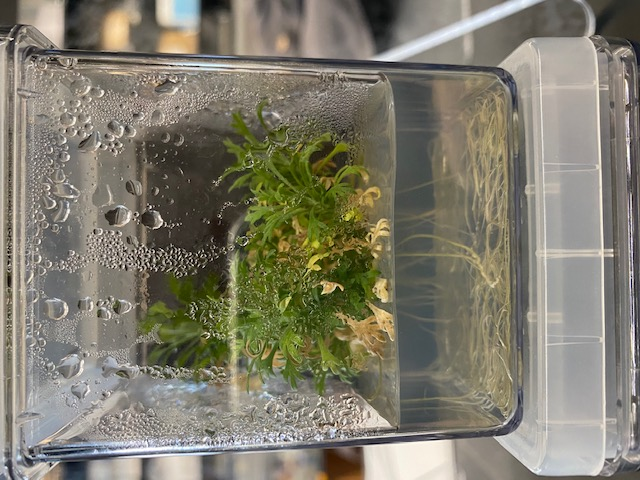

# Aim

Sequencing, phasing and annotating the diploid genome of basin big sagebrush (*Artemisia tridentata* subsp. *tridentata*). This taxon as 2n=2x=18 chromosomes and a 2C genome size of 9.5Gbp. In addition, preliminary analyses demonstrated that the genome is highly out-bred. 

# Overall approach & Requirements

To be able to phase such complex genome, we aim at generating 50-100X raw data coverage (haploid sagebrush genome size: 4.5 Gbp) using PacBio technology and phase it using proximity ligation data. Such wet-lab procedures are requiring the production of ca. **120 gr. of leaf biomass**.

## Biomass requirements for genome project

We aim at applying newly developed *in vitro* tissue culture technique [@Barron2020] to G2_b24_1 (from UTT2, drought-sensitive genotype; see Figure \@ref(fig:plantlets)) to produce the ca. 120 gr of leaf biomass necessary for genome sequencing, phasing and annotation.

```{r plantlets, echo=F, eval=T, out.width="50%", fig.align='center', fig.cap= "Example of a 15-week old plantlet grown in vitro in Magenta vessel."}

```

After 15 weeks of *in vitro* culture, **a plantlet produces 0.8 gr. of leaf biomass** that can be used for the genome project (Figure \@ref(fig:plantletweight)). To meet our requirements **a minimum of `r 120/0.8` plantlets have to be produced at BSU** (see table below). The biomass can be flash frozen and stored in the -80C freezer. The estimation of biomass does not account for a DNA extraction trial to optimize protocol (we need at least 15ug of HMW DNA for PacBio sequencing). We will have to discuss with the project manager at Dovetail Genomics.

```{r plantletweight, echo=F, eval=T, out.width="50%", fig.align='center', fig.cap= "A 15-week old plantlet grown in vitro in Magenta vessel generates 0.8 gr of leaf biomass for sequencing."}
knitr::include_graphics("Figures/G2_b20_1_Biomass_0.855g_after2min.jpg")
```

### Number of plantlets per sequencing technology

Table \@ref(tab:tabproject) provides a summary of sequencing technologies, their purpose and requierements to complete the sagebrush genome project.

```{r tabproject, echo=FALSE, eval=TRUE}
#Table with data on sequencing and number of plantlets requiered for project
dat <- data.frame(Type = c("PacBio sequencing", "Proximity ligation (Hi-C for phasing genome)", "RNA-seq"),
                    #Add purpose
                    Purpose = c("De novo genome assembly", "Phasing", "Annotation"),
                    # add requirements 
                    `Unit/Biomass` = c("1 cell = 20 gr", "1 Illumina library = 6 gr", "1 library = 20 mg"),
                    # add Total for project
                    `Total units / biomass` = c("5 cells = 100 gr", "3 libraries = 18 gr", "1 library = 20 mg"),
                    #Add Number of plantlets
                    `Number plantlets` = c(ceiling(100/0.8), ceiling(18/0.8), ceiling(0.2/0.8))
                  )
colnames(dat) <- c("Type","Purpose","Unit/Biomass","Total units / biomass","Number of plantlets")
#Plot table
knitr::kable(dat, caption = "Summary of sequencing technologies, their purpose and requierements to complete the sagebrush genome project.")
```


# Meet the team

- **Peggy Martinez, M.S.** (peggymartinez@boisestate.edu): Laboratory Technician leading the sagebrush *in vitro*  culture program at Boise State University. 
- **Rachael Barron, M.S.** (rachael.barron@simplot.com): Associate Scientist at Simplsot who has contributed her expertise on *in vitro* culture to this project.
- **Marcelo Serpe, Ph.D**: Professor at Boise State University.
- **Sven Buerki, Ph.D** (sven.buerki@boisestate.edu): Assistant Professor at Boise State University and PI of this project funded by [GEM3](funding.html).

# References